# Software Engineering Methods
Master Build Status   
Develop Build Status   
License   
CodeCov   
Release   

|ID|Title|Done or Not|Screenshot|
|:--:|:---------------------------------------------------------------------------------:|:-----------:|:--------------------------------:|
1 |All the countries in the world organised by largest population to smallest| Yes|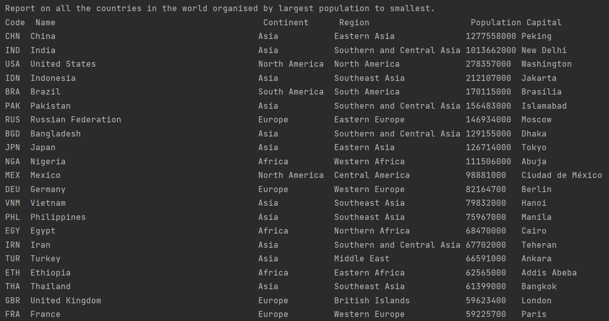|
2 |All the countries in Europe organised by largest population to smallest| Yes|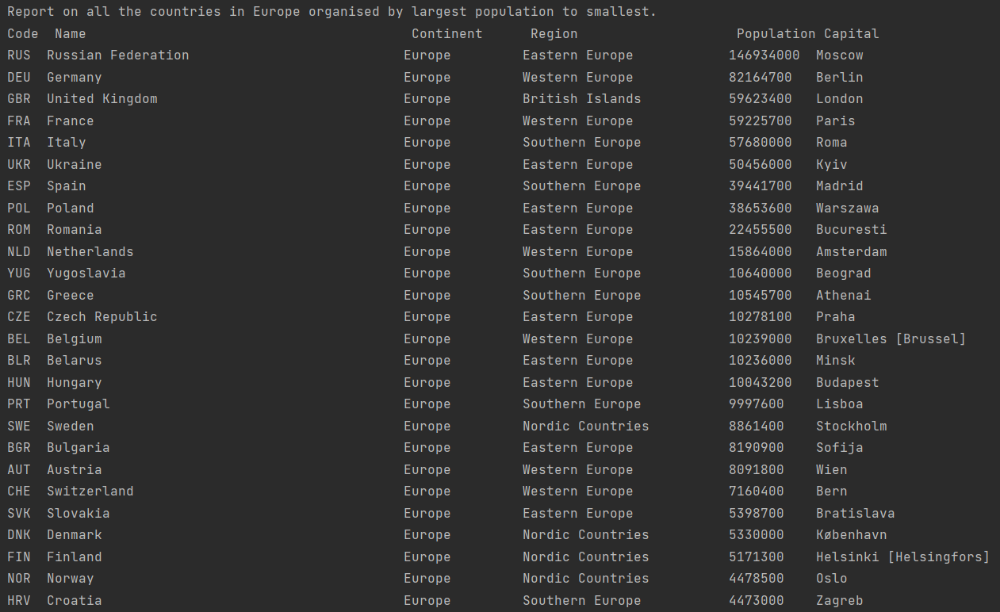|
3 |All the countries in Nordic Countries organised by largest population to smallest| Yes|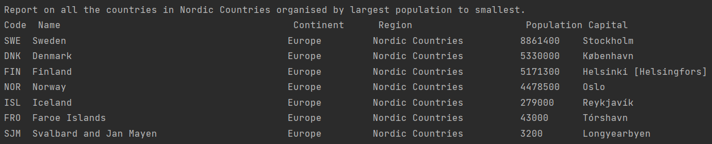|
4 |The top N populated countries in the world where N is provided by the user| Yes|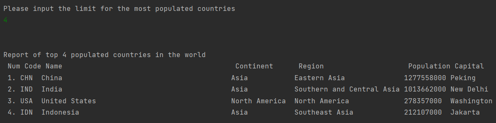|
5 |The top N populated countries in Europe where N is provided by the user| Yes|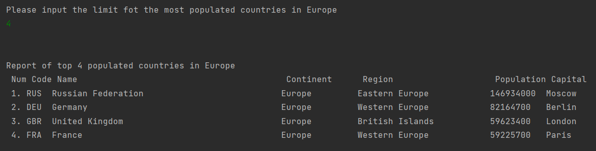|
6 |The top N populated countries in the Baltic region where N is provided by the user| Yes|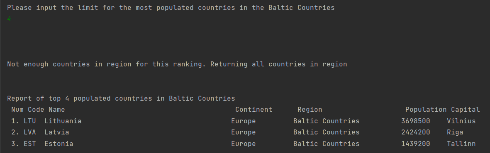|
7 |All the cities in Europe organised by largest population to smallest| Yes||
8 |All the cities in a continent organised by largest population to smallest| Yes|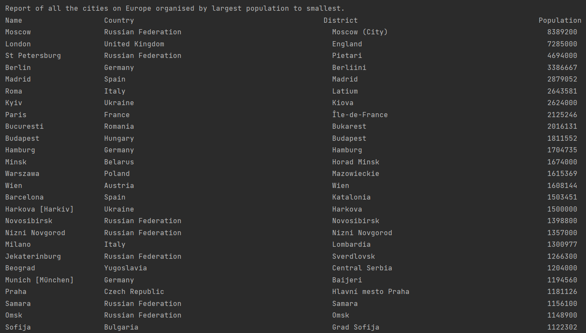|
9 |All the cities in Middle East organised by largest population to smallest| Yes|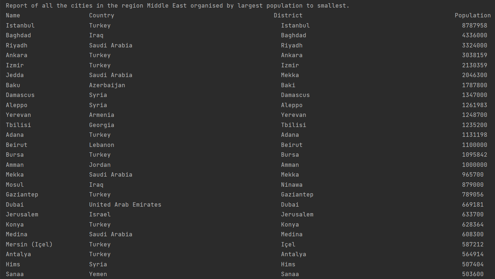|
10 |All the cities in Spain organised by largest population to smallest| Yes|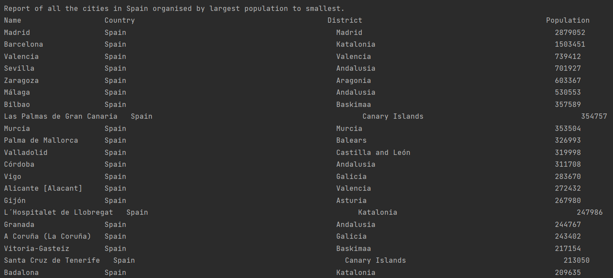|
11 |All the cities in the Ile de France district organised by largest population to smallest| Yes|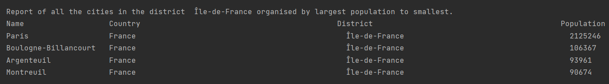|
12 |The top N populated cities in the world where N is provided by the user| Yes|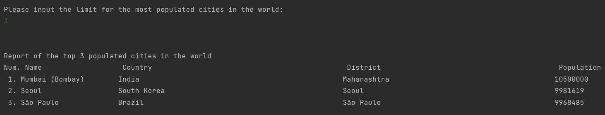|
13 |The top N populated cities in Europe where N is provided by the user| Yes|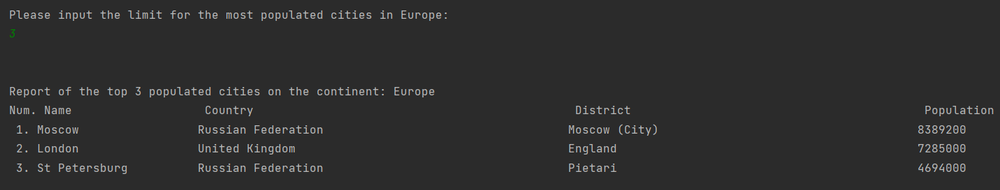|
14 |The top N populated cities in Middle East where N is provided by the user| Yes|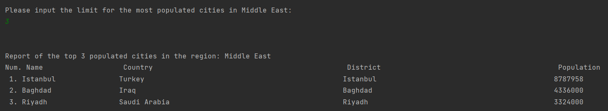|
15 |The top N populated cities in Spain where N is provided by the user| Yes|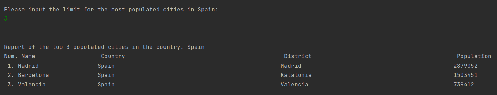|
16 |The top N populated cities in the Ile De France district where N is provided by the user| Yes|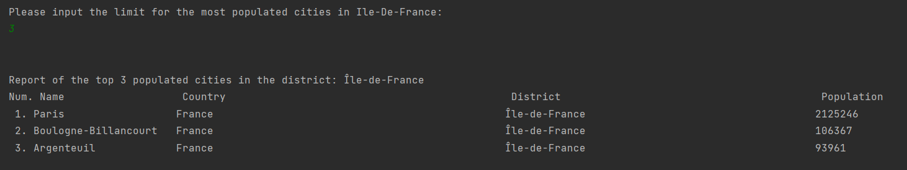|
17 |All the capital cities in the world organised by largest population to smallest| Yes|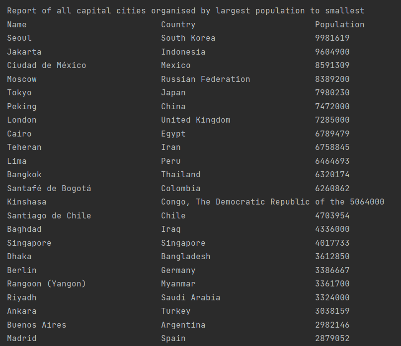|
18 |All the capital cities in Europe organised by largest population to smallest| Yes|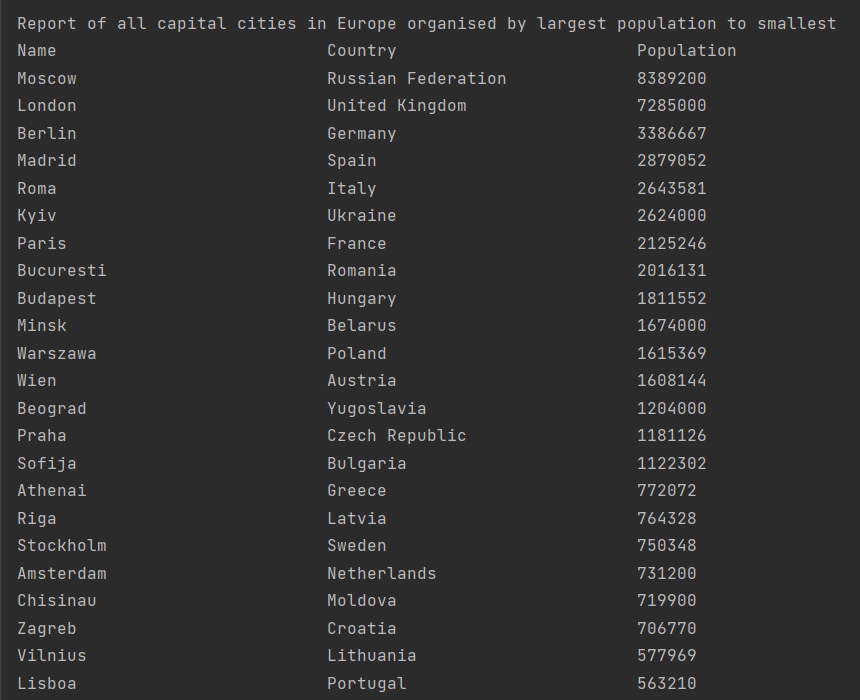|
19 |All the capital cities in Middle East organised by largest to smallest| Yes|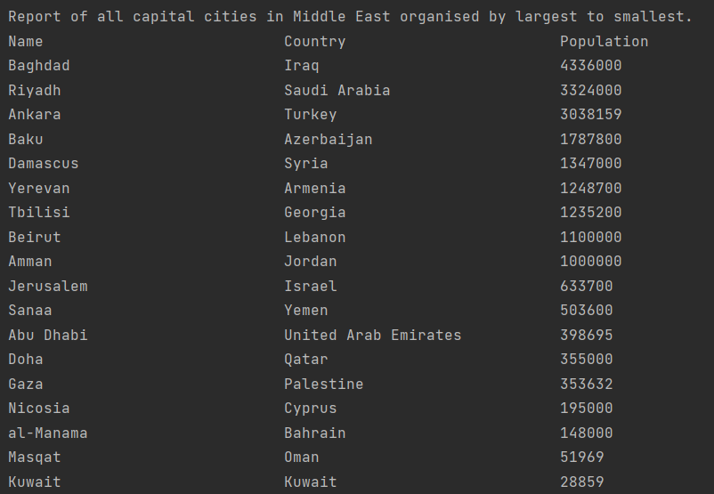|
20 |The top N populated capital cities in the world where N is provided by the user| Yes|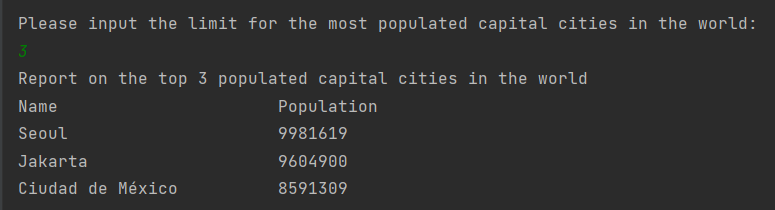|
21 |The top N populated capital cities in Asia where N is provided by the user| Yes|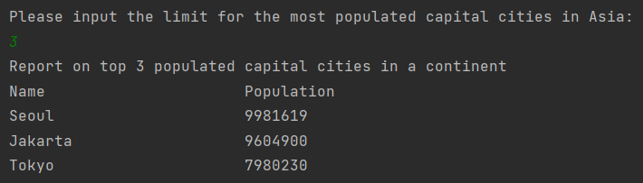|
22 |The top N populated capital cities in the Southern Europe region where N is provided by the user| Yes|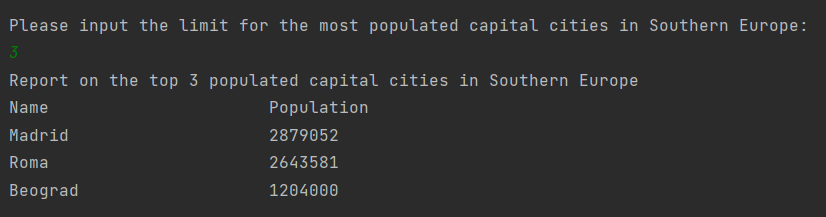|
23 |The population of people, people living in cities, and people not living in cities in each continent| Yes|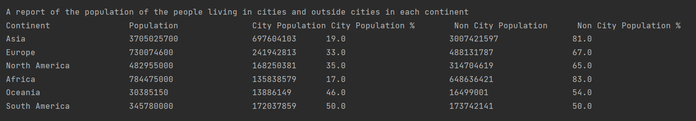|
24 |The population of people, people living in cities, and people not living in cities in each region| Yes|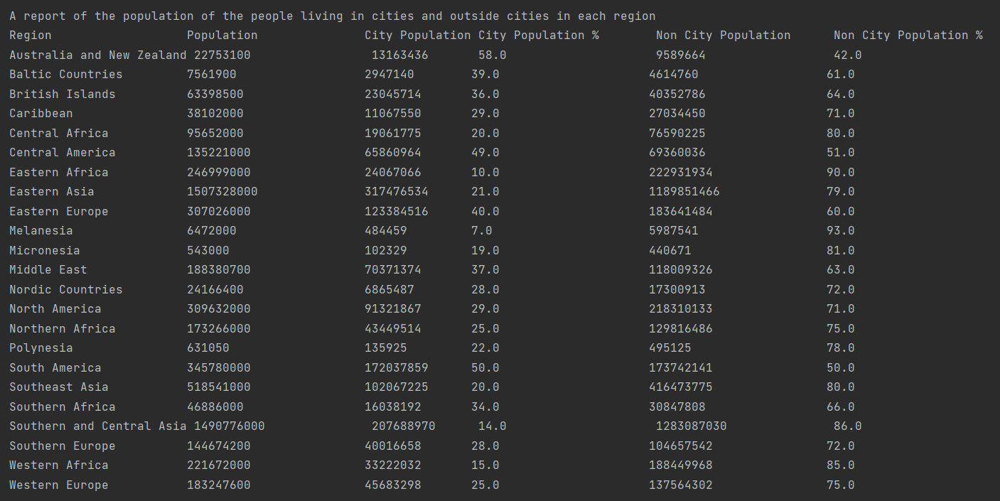|
25 |The population of people, people living in cities, and people not living in cities in each country| Yes|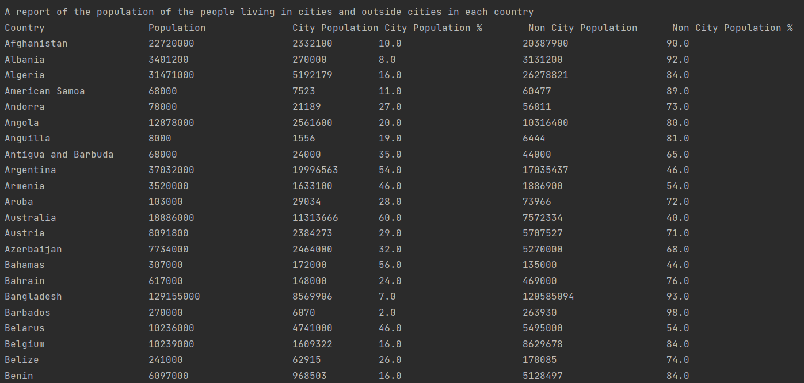|
26 |The population of the world| Yes|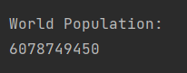|
27 |The population of Europe| Yes|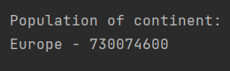|
28 |The population of Middle East| Yes|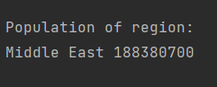|
29 |The population of Canada| Yes|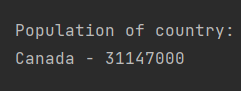
30 |The population of the Ile De France district| Yes|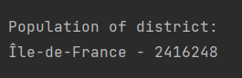|
31 |The population of Madrid| Yes|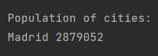|
32 |The number of people who speak Chinese, English, Hindi, Spanish, Arabic, listed from greatest number to smallest, including the percentage of the world population| Yes|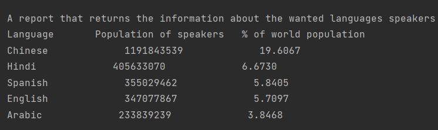|